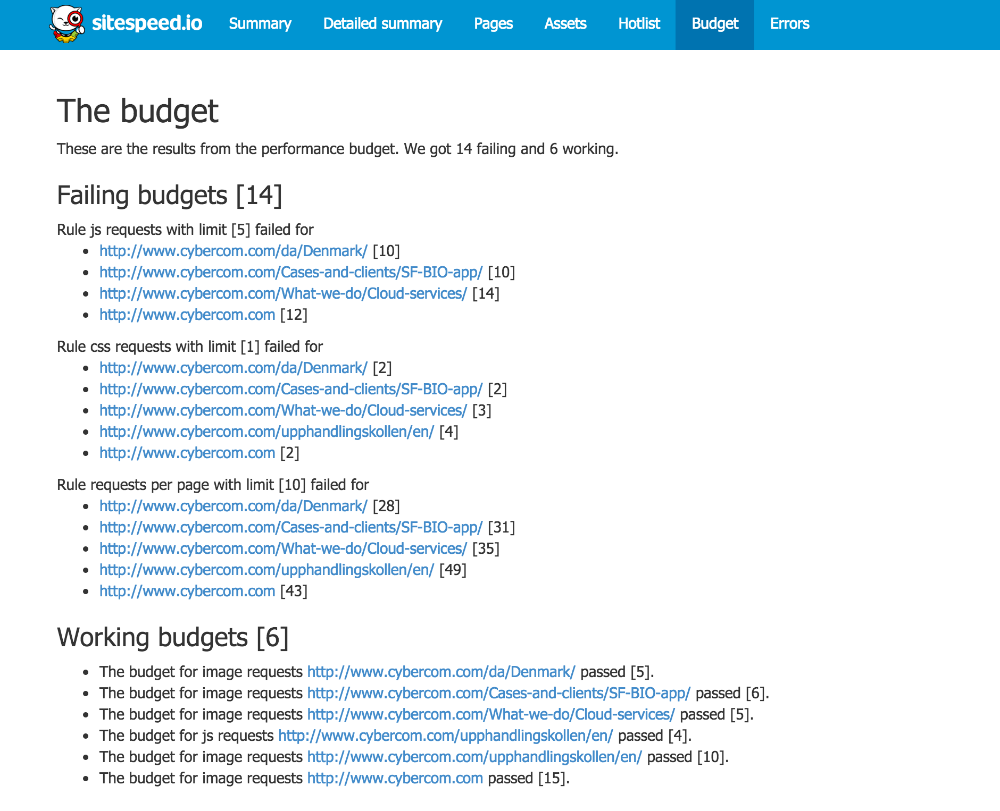

# Documentation version 3.0
{:.no_toc}

* Lets place the TOC here
{:toc}

# Introduction
Sitespeed.io is an open source tool that helps you understand if your site is fast or not. It tests your site against web performance best practice rules, get timings using Chrome/Firefox or PhantomJS 2 (using the Navigation Timing API and User Timing API).

You can also drive [WebPageTest](http://www.webpagetest.org/) using sitespeed.io, collecting data from multiple URL:s tested using WebPageTest.

Sitespeed.io outputs the information as HTML/JSON or JUnit XML or [TAP](http://testanything.org/). And can automatically send the collected metrics to [Graphite](http://graphite.wikidot.com/).

# Download and installation

## Install on Mac, Linux & Windows

Prerequisites: Install [NodeJS](http://nodejs.org/download/) ([Linux](https://github.com/creationix/nvm)) and make sure you have [npm](https://github.com/npm/npm) installed.

~~~ bash
$ npm install sitespeed.io
~~~

If you want it installed globally (running it from wherever):

~~~ bash
$ npm install -g sitespeed.io
~~~

Run

~~~ bash
sitespeed.io -h
~~~

or on Windows:

~~~ bash
$ sitespeed.io.cmd -h
~~~

## Vagrant

We have a couple of [Vagrant](https://github.com/sitespeedio/sitespeed.io-vagrant) boxes to get you up and running fast (installing sitespeed.io and browsers).

* [Ubuntu 14](https://github.com/sitespeedio/sitespeed.io-vagrant/tree/master/sitespeed-ubuntu14)
* [CentOS 7](https://github.com/sitespeedio/sitespeed.io-vagrant/tree/master/sitespeed-centos7)

## Docker

We have a docker [image](https://registry.hub.docker.com/u/sitespeedio/sitespeed.io-docker/) with sitespeed.io, Chrome, Firefox and Xvfb.

# Configuration
Sitespeed.io is highly configurable, let's check it out!

## The options
You have the following options running sitespeed.io:

~~~
Usage: node sitespeed.js [options]

Options:
-u &lt;URL&gt;, --url &lt;URL&gt;                                  The start url that will be used when crawling.
-f &lt;FILE&gt;, --file &lt;FILE&gt;                               The path to a plain text file with one URL on each row. Each URL will be analyzed.
--sites &lt;FILE&gt;                                         The path to a plain text file with one URL on each row. Each URL is crawled.
-V, --version                                          Display the sitespeed.io version.
-d &lt;INTEGER&gt;, --deep &lt;INTEGER&gt;                         How deep to crawl.  [1]
-c &lt;KEYWORD&gt;, --containInPath &lt;KEYWORD&gt;                Only crawl URLs that contains this in the path.
-s &lt;KEYWORD&gt;, --skip &lt;KEYWORD&gt;                         Do not crawl pages that contains this in the path.
-t &lt;NOOFTHREADS&gt;, --threads &lt;NOOFTHREADS&gt;              The number of threads/processes that will analyze pages.  [5]
--name &lt;NAME&gt;                                          Give your test a name, it will be added to all HTML pages.
--memory &lt;INTEGER&gt;                                     How much memory the Java processed will have (in mb).  [1024]
-r &lt;DIR&gt;, --resultBaseDir &lt;DIR&gt;                        The result base directory, the base dir where the result ends up.  [sitespeed-result]
--outputFolderName                                     Default the folder name is a date of format yyyy-mm-dd-HH-MM-ss
--userAgent &lt;USER-AGENT&gt;                               The full User Agent string, default is Chrome for MacOSX. [userAgent|ipad|iphone].  [Mozilla/5.0 (Macintosh; Intel Mac OS X 10_9_4) AppleWebKit/537.36 (KHTML, like Gecko) Chrome/37.0.2062.120 Safari/537.36]
--viewPort &lt;WidthxHeight&gt;                              The view port, the page viewport size WidthxHeight like 400x300.  [1280x800]
-y &lt;FILE&gt;, --yslow &lt;FILE&gt;                              The compiled YSlow file. Use this if you have your own rules.  headless/yslow-3.1.8-sitespeed.js]
--ruleSet &lt;RULE-SET&gt;                                   Which ruleset to use.  [sitespeed.io-desktop]
--limitFile &lt;PATH&gt;                                     The path to the limit configuration file.
--basicAuth &lt;USERNAME:PASSWORD&gt;                        Basic auth user & password.
-b &lt;BROWSER&gt;, --browser &lt;BROWSER&gt;                      Choose which browser to use to collect timing data. Use multiple browsers in a comma separated list (firefox|chrome|headless)
--connection                                           Limit the speed by simulating connection types. Choose between mobile3g,mobile3gfast,cable,native  [native]
--btConfig &lt;FILE&gt;                                      Additional BrowserTime JSON configuration as a file
--profile &lt;desktop|mobile&gt;                             Choose between testing for desktop or mobile. Testing for desktop will use desktop rules & user agents and vice verca.  [desktop]
-n &lt;NUMBEROFTIMES&gt;, --no &lt;NUMBEROFTIMES&gt;               The number of times you should test each URL when fetching timing metrics. Default is 3 times.  [3]
--screenshot                                           Take screenshots for each page (using the configured view port).
--junit                                                Create JUnit output to the console.
--tap                                                  Create TAP output to the console.
--skipTest &lt;ruleid1,ruleid2,...&gt;                       A comma separated list of rules to skip when generating JUnit/TAP output.
--testData                                             Choose which data to send test when generating TAP/JUnit output. Default is all available [rules,timings,wpt,gpsi]  [all]
--budget &lt;FILE&gt;                                        A file containing the web perf budget rules. See http://www.sitespeed.io/documentation/#budget
-m &lt;NUMBEROFPAGES&gt;, --maxPagesToTest &lt;NUMBEROFPAGES&gt;   The max number of pages to test. Default is no limit.
--storeJson                                            Store all collected data as JSON.
-p &lt;PROXY&gt;, --proxy &lt;PROXY&gt;                            http://proxy.soulgalore.com:80
--cdns &lt;cdn1.com,cdn.cdn2.net&gt;                         A comma separated list of additional CDNs.
--postTasksDir &lt;dir&gt;                                   The directory where you have your extra post tasks.
--boxes &lt;box1,box2&gt;                                    The boxes showed on site summary page, see http://www.sitespeed.io/documentation/#config-boxes
-c &lt;column1,column2&gt;, --columns &lt;column1,column2&gt;      The columns showed on detailed page summary table, see http://www.sitespeed.io/documentation/#config-columns
--configFile &lt;PATH&gt;                                    The path to a sitespeed.io config.json file, if it exists all other input parameters will be overidden.
--aggregators &lt;PATH&gt;                                   The path to a directory with extra aggregators.
--collectors &lt;PATH&gt;                                    The path to a directory with extra collectors.
--graphiteHost &lt;HOST&gt;                                  The Graphite host.
--graphitePort &lt;INTEGER&gt;                               The Graphite port.  [2003]
--graphiteNamespace &lt;NAMESPACE&gt;                        The namespace of the data sent to Graphite.  [sitespeed.io]
--graphiteData                                         Choose which data to send to Graphite by a comma separated list. Default all data is sent. [summary,rules,pagemetrics,timings]  [all]
--gpsiKey                                              Your Google API Key, configure it to also fetch data from Google Page Speed Insights.
--noYslow                                              Set to true to turn of collecting metrics using YSlow.
--html                                                 Create HTML reports. Default to true. Set no-html to disable HTML reports.  [true]
--wptConfig &lt;FILE&gt;                                     WebPageTest configuration, see https://github.com/marcelduran/webpagetest-api runTest method
--wptHost &lt;URL&gt;                                         The host domain of the webpagetest instance.
--wptKey &lt;KEY&gt;                                         The API key if running on webpagetest on the public instances.
--headless                                             Choose which backend to use for headless [phantomjs|slimerjs]  [phantomjs]
--requestHeaders &lt;FILE&gt;                                Any request headers to use, a file with JSON form of {"name":"value","name2":"value"}. Not supported for WPT & GPSI.
~~~

Yep, that was a lot, we know. Lets go into some standard use cases.

## The basics
If you installed with the global option (-g), run the command *sitespeed.io* else run the script *lib/sitespeed.js*.  In the examples we will use the script but you know what to do if you have it installed.

You can analyze a site either by crawling or feed sitespeed.io with the URL:s you want to analyze.

### Analyze by crawling
The crawler needs a start URL (the parameter **u**, from where it will start the crawl). It will fetch all links within the same domain as the URL that you provide. You can then choose how deep you want to crawl with the **d** parameter. Zero will fetch only the
  URL that you provide. One will fetch all links on that page and analyze these, two will go one level deeper and so on. If you want to analyze a site and the links with a depth of two, you do like this:

~~~ bash
$ sitespeed.io -u http://www.yoursite.com -d 2
~~~

Remember that you can start your crawl deep into your path structure like http://yoursite.com/my/path
{: .note .note-info}

### Analyze by URL:s
Instead of giving a start URL for the crawl, you can supply a plain text file with one URL on each row. Then each of these URL will be analyzed, no more or no less. A file like this will do:

~~~
http://www.yoursite.com/path/
http://www.yoursite.com/my/really/important/page/
http://www.yoursite.com/where/we/are/
~~~

Then you feed the file to the script:
~~~ bash
$ sitespeed.io -f myurls.txt
~~~

This is good for testing and keep tracks of your site in production and you have a LARGE site with many pages and a couple of them are more important than the rest.
{: .note .note-info}

### Analyze sites and benchmark
If you want to test and benchmark sites you can do like this:

~~~
http://www.yoursite.com/path/
http://www.mycompetition.com/
http://www.mycompetition2.com/
~~~

Then you feed the file to the script and each URL will be crawled. You can run the crawl the exact same way as usual, by feeding parameters.

~~~ bash
$ sitespeed.io --sites mysitesurls.txt
~~~

If you instead want to compare a couple of URL:s between sites (pre defined URLS instead of crawling), do like this: Create a master plain text file. Each row of this file points out another file that contains the specific URLs for that site. The master looks like this (master.txt):

~~~
theguardian.txt
nytimes.txt
...
~~~

Then create the specific files (theguardian.txt):

~~~
http://www.theguardian.com/uk
http://www.theguardian.com/uk/sport
http://www.theguardian.com/uk/culture
~~~

And nytimes.txt:

~~~
http://www.nytimes.com/
http://www.nytimes.com/pages/sports/index.html
http://www.nytimes.com/pages/fashion/index.html
~~~

You can of course add how many URL:s and sites you want. Then you run the whole thing like this:

~~~ bash
$ sitespeed.io --sites master.txt
~~~
Checkout the Graphite section to see how you can graph the runs nicely.

### Include/exclude URL:s when crawling
You want to make sure that parts of your site isn't included in your analyze, then you can add the parameter **s** and a keyword. Every URL with that keyword will not be included.

~~~ bash
$./bin/sitespeed.io -u http://yoursite.com  -s /monkey/
~~~
You can also do it the other way around, with the **c** and a keyword. In this case, the analyze will only include URL:s with the keyword.

~~~ bash
$  ./bin/sitespeed.io -u http://yoursite.com  -c /the/path/
~~~

### Screenshots
You can get screenshots of every page that you analyze. These will end up on a screenshot page where you can check them all. The screenshots will be taken for the chosen viewport.

~~~ bash
$ sitespeed.io -u http://yoursite.com  --screenshot
~~~

### Shortcut: test as desktop or mobile
By default you test as desktop, if you turn on mobile by just setting the profile. If you do that, you will automatically test with
mobile rules, an IOS user agent, view port of 320x444 and on a throttled connection simulating a mobile 3g connection.

~~~ bash
$ sitespeed.io -u http://yoursite.com  --profile desktop
~~~

~~~ bash
$ sitespeed.io -u http://yoursite.com  --profile mobile
~~~

### Viewport/user agent and mobile
You can set the viewport & user agent, so that you can fake testing a site as a mobile device.

By default the viewport is 1280x800 with the following user agent for Chrome on MacOSX.

~~~ bash
$ sitespeed.io -u http://yoursite.com  --viewPort 400x300 --userAgent "My SUPER BROWSER"
~~~

Mobile testing is always best on mobile devices. For tips on how to best do that, read Andy Davies [blog](http://andydavies.me/").
{: .note .note-warning}

### Limit pages to test
Sometimes you want to limit the amount to test (I do that when I compare sites). That will test maximum the amount of pages you supply.

~~~ bash
$ sitespeed.io -u http://yoursite.com  -m 10
~~~

### Set a name of your test
You can give your test run a name that will be showed on all the pages

~~~ bash
$ sitespeed.io -u http://yoursite.com/ --name "Swedens top 100 sites"
~~~

### Collect timing metrics
Sitespeed.io collect timing metrics using the Navigation Timing API and the User Timing API. Today you can use Chrome, Firefox, PhantomJS 2.0 and SlimerJS. We also have exprimental support for Internet Explorer (ie) and Safari.

Add the parameter **b** followed by the browser name.
~~~ bash
$ sitespeed.io -u http://yoursite.com  -b firefox
~~~

Each page is tested 3 times by default. You can change that with the **n** parameter.  Test using Chrome and test each page 9 times, looks like this:

~~~ bash
$ sitespeed.io -u http://yoursite.com  -b chrome -n 9
~~~

If you want to test in multiple browsers, you add them in a comma separated list

~~~ bash
$ sitespeed.io -u http://yoursite.com  -b firefox,chrome -n 7
~~~

### Throttle the connection
You can throttle the connection when you are fetching metrics using the browser. Choose between:

* **mobile3g** - 1.6 Mbps/768 Kbps - 300 RTT
* **mobile3gfast** - 1.6 Mbps/768 Kbps - 150 RTT
* **cable** - 5 Mbps/1 Mbps - 28 RTT
* **native** - the current connection

And do like this:

~~~ bash
$ sitespeed.io -u http://yoursite.com -b chrome --connection mobile3g
~~~

## A little more nerdy

### Fetch data Google Page Speed Insights
To test each page using GPSI, you need to have a a Google API Key. You can get one [here](https://console.developers.google.com/project). Testing using GPSI will
  include the GPSI score in the summary page and all individual data on the detailed page.

~~~ bash
$ sitespeed.io -u http://yoursite.com  --gpsiKey MY_SECRET_KEY
~~~

### Fetch data from WebPageTest

Yep, it is true! You can drive WebPageTest from sitespeed.io. You need to either have your own private instance or an API key.

~~~ bash
$ sitespeed.io -u http://yoursite.com  --wptHost www.webpagetest.org --wptKey MY_SECRET_API_KEY
~~~

In the background Marcel Durans WPT API is used, specific the [runTest](https://github.com/marcelduran/webpagetest-api#user-content-test-works-for-test-command-only) method.
  You can pass all the parameters in the runTest through sitespeed.io by the **--wptConfig** parameter and supply a JSON file.

By default, the following values are passed to WPT:

~~~
pollResults: 10,
timeout: 600,
firstViewOnly: false,
runs: // the number of runs you configure by the n parameter
private: true,
aftRenderingTime: true,
location: 'Dulles:Chrome',
video: true
~~~

And if you configured basic auth, the login/password is also passed to WPT.

If you pass your own **--wptConfig**, a fields matching will override the default configuration.

### Send your data to Graphite

You can choose to send your data to Graphite, to keep track of your performance over time.
You configure four things: the host, port, the namespace and which data to send. Default value for the port is 2003, namespace (the start of the key) is sitespeed and send all collected data.

~~~ bash
$ sitespeed.io -u http://www.sitespeed.io --graphiteHost localhost
~~~

### Set request headers
The headers can be set if you collect rules and timings. It will not work for WPT and GPSI. Supply a JSON file like this:

~~~
{
  "mysupercoolheader":"value",
  "coolheader2":"value2"
}
~~~

And the run like this:

~~~ bash
$ sitespeed.io -u http://www.sitespeed.io --requestHeaders myheaders.txt
~~~

### Configure boxes on summary page
You can choose which boxes you want to show on the summary page by configure them by their name. You can choose to show to configure them exactly as you want. Then you need to pass every name to the script:

~~~ bash
$ sitespeed.io -u http://www.sitespeed.io --boxes thirdpartyversions,ycdn
~~~

Or if you want to add boxes to the already pre-configured ones, you can add a plus sign before the name(it is perfect
  if you have your own User Timings that you want to show):

~~~ bash
$ sitespeed.io -u http://www.sitespeed.io -b chrome --boxes +logoTime,headerTime
~~~

These boxes will then end up in the end of the list.

### Configure columns on pages page
You can choose what kind of data you want to show in the column pages. The naming is far from perfect today or you could say it's broken, lets change that in coming major releases.

If you want to show data that are collected from YSlow, like number of javascripts, you do that like this:
~~~ bash
$ sitespeed.io -u http://www.sitespeed.io -c yslow.assets.js,yslow.assets.css,yslow.requests,yslow.pageWeight
~~~

If you want to fetch timings from your browser, they are following this pattern (headerTime is a User Timing):
s
~~~ bash
$ sitespeed.io -u http://www.sitespeed.io -c timings.serverResponseTime.median,timings.domContentLoadedTime.median,timings.headerTime.median -b chrome
~~~

If you have problem, create an issue and we will help you.

# Fetching browser timings
You can fetch timings (Navigation Timing and User Timings) using real browsers using the **-b** flag. We use
    [Browsertime](https://github.com/tobli/browsertime) to collect the data. By a default
    installation you can fetch timings using Chrome and Firefox (as long as you have them installed on your machine).

There's also prepared support for Safari and Internet Explorer (Windows only). To test them out,you need to run your start your own [Selenium server](http://www.seleniumhq.org/download/). By default
    sitespeed.io will try to reach it at **http://localhost:4444/wd/hub**.

To get Safari to work, you need to install the [SafariDriver extension](https://github.com/SeleniumHQ/selenium/tree/master/javascript/safari-driver) in the browser. We haven't tested this yet, please help us out and update the doc on how to do it.

To get Internet Explorer to work, follow the [instructions](https://code.google.com/p/selenium/wiki/InternetExplorerDriver#Required_Configuration).

There's a problem using sitespeed.io/BrowserTime on Windows, where the BrowserMobProxy isn't closed/killed between runs, you need to kill it yourself right now.
{: .note .note-warning}

# Using WebPageTest
Yep we all love [WebPageTest](http://www.webpagetest.org) (WPT), so we made it possible to drive an instance of and collect the data from it.

To use WPT you can either get an [API key](http://www.webpagetest.org/getkey.php) (sponsored by Akamai) for the global version or follow Pat Meenans instructions on [how to get a private version up and running in 5 minutes](http://calendar.perfplanet.com/2014/webpagetest-private-instances-in-five-minutes/).

Out of the it will collect [these](https://github.com/sitespeedio/sitespeed.io/tree/master/lib/aggregators/webpagetest") metrics that can be displayed on the summary page. By default, these will be shown:

{: .img-thumbnail}

On the pages summary, you will also automatically get the SpeedIndex score:

{: .img-thumbnail}

And on the detailed summary page, we show some interesting metrics and the waterfalls
for the median result of both first and repeated view:

{: .img-thumbnail}

## Configuration
There is some default configuration that is passed to WebPageTest. It looks like this:

~~~
{
  pollResults: 10,
  timeout: 600,
  firstViewOnly: false,
  runs: n, // the number of times passed by -n, default 3
  private: true,
  aftRenderingTime: true,
  location: 'Dulles:Chrome',
  video: true
}
~~~

And if basic auth is set, it is passed as basic auth.

In the background the test method in Marcel Durans webpagetest-api is used, so you can configure almost everything. Checkout the docs [here](https://github.com/marcelduran/webpagetest-api#user-content-test-works-for-test-command-only). You configure your own stuff by feeding sitespeed.io with a JSON file. Say you want to test form Dulles using a throttled 3G connection:

~~~
{
  "location": "Dulles:Firefox",
  "connectivity": "3G"
}
~~~
The default location will be overidden and the connectivity will be set to 3G.
Feed it with: *--wptConfig yourFile.json*

If you want to test from multiple locations, browsers or different connectivity, pass an array as configuration:

~~~
[
  {
    "location": "Dulles:Firefox",
    "connectivity": "3G"
  },
  {
    "location": "Dulles:Chrome",
    "connectivity": "Cable"
  }
]
~~~

### Graph the WPT metrics
The data collected and showed can also be sent to Graphite. Checkout the Graphite [section](#graphite-full)>.

### WPT performance budget
The timings and metrics collected by WebPageTest can also be used in you performance budget. More info [budget](#budget).

# Using Google Page Speed Insights
Google Page Speed Insights (GPSI) is Google:s rule/best practices rules to build a web site that are as fast as possible. Follow the rules and your site will be fast.

Sitespeed.io integrates GPSI so you can fetch how good your site is doing. Two things: Your site needs to reachable from the internet (and no basic authentication) and you need to supply your own [Google key](https://console.developers.google.com/project).

Run it like this:

~~~bash
$ sitespeed.io -u http://yoursite.com  --gpsiKey MY_SECRET_KEY
~~~

Sitespeed.io will collect all available data from GPSI. On the summary page, the GPSI score will be shown. We also collect number of requests. You can check the implementation [here](https://github.com/sitespeedio/sitespeed.io/tree/master/lib/aggregators/gpsi) and add an issue if you want us to collect more data:

{: .img-thumbnail}

On the pages summary, you will also automatically the GPSI score:

{: .img-thumbnail}

And on the detailed summary page, we show all the data that are provided by GPSI, it looks like this:

{: .img-thumbnail}

# PhantomsJS 2
[PhantomJS](http://phantomjs.org/) is used by default when validating the web performance best practice rules. Soon (!) we will upgrade to the (almost) released 2.0 version. If you want to try out the 2.0 and use it when you run sitespeed.io, do like this:

* Follow <a href="https://github.com/ariya/phantomjs/wiki/PhantomJS-2">these</a> instructions to build PhantomJS 2.
* Run sitespeed.io and configure it to use your own version of PhantomJS

~~~bash
sitespeed.io -u http://www.sitespeed.io --phantomjsPath /the/path/to/your/bin
~~~
* If you also want to collect timings using PhantomJS, run it like this:

~~~bash
sitespeed.io -u http://www.sitespeed.io --phantomjsPath /the/path/to/your/bin -b headless
~~~

We have tested PhantomJS 2 on Mac OS X and it works really good when testing the site against the best practice rules. However, it seems to be a couple of timings that don't work as expected. If you have time to test and find things that don't work, please let us know and we will update the docs. We aim to give this more love when the stable 2.0 is released.
{: .note .note-warning}

# Continuous integration
Use sitespeed.io to keep track of what is happening with your site and make sure you know that you don't break the performance best practice rules **before** your changes are released.
Your build can also be broken if your page timings (choose whatever timing you need from the Navigation Timing API or your own custom timing) break your limits. And of course, if you use WebPageTest or Google Page Speed Insights, you can use the metrics from them to break your build.

Sitespeed.io outputs [JUnit XML](http://help.catchsoftware.com/display/ET/JUnit+Format) and [TAP](http://testanything.org/) that test your metrics against your configured limits.

## Generating JUnit XML or TAP
Sitespeed can output **junit.xml** that works perfect with your continuous integration tool. Jenkins, Bamboo and others support it out of the box.

~~~bash
$ sitespeed.io -u http://www.sitespeed.io --junit
~~~

Or if you rather prefer TAP:

~~~bash
$ sitespeed.io -u http://www.sitespeed.io --tap
~~~

## Configure when to break a test
By default these are the values that are tested:

~~~
{
  "rules": {
    "default": 90
  },
  "timings": {
    "serverResponseTime": 300,
    "domContentLoadedTime": 700,
    "speedIndex": 1000
  },
  "wpt": {
    "SpeedIndex": 1000
  },
  "gpsi": {
    "score": 90
  }
}
~~~

This means that all rules must be 90 or better,serverResponseTime 300 ms or better,
domContentLoadedTime to be faster than 700 ms. If you use WebPageTest, the speed index need to be under 1000. And finally, if you use Goggle Page Speed Insights, the score must be 90 or better.

You can configure to point out a JSON file containing all the values:

~~~bash
$ sitespeed.io -u http://www.sitespeed.io --tap --budget myBudget.json
~~~

## Skip rule tests
By default a all rules is tested against the default number you specify, meaning all rules needs to be 90 or better. Sometimes you have some rules you don't care about and can skip. You do that by feeding the rule names to the script. You find all the names [here](https://github.com/sitespeedio/yslow/blob/master/src/common/rulesets/ruleset_sitespeed.js).

~~~bash
$ sitespeed.io -u http://www.sitespeed.io --skipTest ycdn,textcontent --tap
~~~

## Fetching timings headless
Fetching timings using PhantomJS 2.0 is headless by default. If you run on Linux and want to emulate a screen (a.k.a running a browser without a screen), you need to do this before running:

* Install [Xvfb](http://www.x.org/releases/current/doc/man/man1/Xvfb.1.xhtml).
* Setup a start script, something like [this](https://gist.github.com/jterrace/2911875)
* Export the display, make sure to have the same number as in the examle in the Gist: **export DISPLAY=:99.0**
* Start Xvfb: **sh -e /etc/init.d/xvfb start**

## Jenkins
You may love or you may hate [Jenkins](http://jenkins-ci.org/"), we think it is a great open source continuous integration server. And to get sitespeed.io up and running is easy. And combine it with Graphite will add some super power.

* Choose **New Item** and create a new freestyle project.
* Choose **Add build step** in the Build part and **Execute shell** you will have a box where you add your sitespeed.io CLI magic. Remember that the Jenkins user needs to have NodeJS in the path. It can look like this (sending the data to a local Graphite instance):
~~~
sitespeed.io -u http://www.cybercom.com --graphiteHost localhost --graphiteNamespace cybercom-production -b chrome -n 11
~~~

* If you want to break your build, you can either generate JUnit XML and use the built in post task **Publish JUnit test result report**.
* In the execute shell form: *sitespeed.io -u http://stage.cybercom.com --resultBaseDir ${WORKSPACE}/${BUILD_NUMBER} --junit > junit.xml* And in the post task **Test report XMLs** add: *junit.xml*
* Using TAP, you need to install the [TAP plugin](https://wiki.jenkins-ci.org/display/JENKINS/TAP+Plugin)
* Run the execute shell like this *sitespeed.io -u http://stage.cybercom.com --resultBaseDir ${WORKSPACE}/${BUILD_NUMBER} --tap > sitespeed.tap*
* And choose the post task **Publish TAP Results** and in the Test Results box add: *sitespeed.tap*

If you want the browsers to run headless, use the [Xvfb plugin](https://wiki.jenkins-ci.org/display/JENKINS/Xvfb+Plugin).

## Travis integration
Coming soon!

## Grunt plugin
There's a Grunt plugin [grunt-sitespeedio](https://github.com/sitespeedio/grunt-sitespeedio) where you can do all the things you usually do with sitespeed.io. Use it create HTML-reports, send metrics to Graphite or test your performance budget.

# Graphite
The easiest way to graph your data (and keep track how you are doing over time), is sending the data to [Graphite](http://graphite.wikidot.com/). And then use a tool to create the graphs. I like [Grafana](http://grafana.org/) because it is super simple and look nice. Here's how you do it:

* Install Graphite - if you are on Mac OS X and want to test it out, use a Vagrant setup.
* Install Grafana - either by Vagrant or just download and install InfluxDb & ElasticSearch
* Send the data from sitespeed.io to Graphite
* Create the graphs in Grafana. We will soonish add a video of how to do it.

Here are a couple of examples of what ut can look like. Here we test one site, something like this:

~~~bash
sitespeed.io -u http://www.cybercom.com --graphiteHost localhost -m 5 --graphiteNamespace cybercom -b chrome -n 11
~~~

And setup the following graphs:

{: .img-thumbnail}

{: .img-thumbnail}

{: .img-thumbnail}

In this example, we compare four Swedish newspapers, running it like this

~~~bash
$ sitespeed.io  --sites /Users/peter/swedish.txt --graphiteHost localhost --graphiteNamespace newspapers -b chrome -n 7
~~~

and the result:

{: .img-thumbnail}

And the last example, we fetch data from WebPageTest and create the following:

{: .img-thumbnail}

If you send all the metrics and don't need the other output (HTML/JSON, it can be quite extensive if you run it often), put all the output in **/tmp** with the **r** switch like this **-r /tmp**.
{: .note .note-info}

  Doesn't all values reach Graphite (are you missing values), then you should check your **carbon.conf** file.
  The configuration **MAX_CREATES_PER_MINUTE** needs to be set to high (we have seen that 50 is too low). To make sure it works, set it like this:

~~~
MAX_CREATES_PER_MINUTE = inf
~~~

{: .note .note-warning}

# Metrics

## Timing metrics
All the metrics are collected using an empty cache
* *backEndTime* - The time it takes for the network and the server to generate and start sending the HTML. Definition: responseStart - navigationStart
* *domContentLoadedTime* - The time the browser takes to parse the document and execute deferred and parser-inserted scripts including the network time from the users location to your server. Definition: domContentLoadedEventStart - navigationStart
* *domInteractiveTime* - The time the browser takes to parse the document, including the network time from the users location to your server. Definition: domInteractive - navigationStart
* *domainLookupTime* - The time it takes to do the DNS lookup. Definition: domainLookupEnd - domainLookupStart
* *frontEndTime* - The time it takes for the browser to parse and create the page. Definition: loadEventStart - responseEnd
* *pageDownloadTime* - How long time does it take to download the page (the HTML). Definition: responseEnd - responseStart
* *pageLoadTime* - The time it takes for page to load, from initiation of the page view (e.g., click on a page link) to load completion in the browser. Important: this is only relevant to some pages, depending on how you page is built. Definition: loadEventStart - navigationStart
* *redirectionTime* - Time spent on redirects. Definition: fetchStart - navigationStart
* *serverConnectionTime* - How long time it takes to connect to the server. Definition: connectEnd - connectStart
* *firstPaint* - This is when the first paint happens on the screen. If the browser support this metric, we use that. Else we use the time of the last non-async script or css from the head. You can easily verify if the first paint metrics is valid for you, by record a video using WebPageTest, and then check exactly when the first paint happens and compare that with the timing from the browser.
* [RUM-SpeedIndex](https://github.com/WPO-Foundation/RUM-SpeedIndex) - created by Pat Meenan
        and calculate SpeedIndex measurements using Resource Timings. It iss not as perfect as Speed Index in WPT but a good start.

## Timing metrics collected using WPT
All the metrics are collected both for first and repeated view.
* *firstPaint* - the time from the start of navigation until the first non-white content was painted to the screen
* *loadTime* - the time from the start of the initial navigation until the beginning of the window load event (onload)
* *TTFB* - the time from the start of navigation until the first byte of the base page is returned (after following any redirects)
* *SpeedIndex* - is the average time at which visible parts of the page are displayed. It is expressed in milliseconds and dependent on size of the view port. You need to [read more](https://sites.google.com/a/webpagetest.org/docs/using-webpagetest/metrics/speed-index) to fully understand how it works.
* *VisualComplete*

# Use cases

## Crawl and test one site
One of the most common use case is to crawl a site and analyze and measure the URL:s. Crawling a site is good because it will find new pages that are linked for the pages you crawl.

I use this for sites where the content team creates new pages directly in the CMS and I as developer are out of control of which pages that exist. Crawling will make sure we pick up new pages and measure them. I usually use this in production to pick up pages that could/should be faster.

Crawling too deep can take long time. One way to handle that is to test specific sections one at a time. Say we want to test sport pages for New York Times:

~~~bash
sitespeed.io -u http://www.nytimes.com/pages/sports/ -c /sports/ -d 2
~~~

Will make sure we only pick up pages under /sports/.

## Test specific URL:s for one site
Testing the same URL over and over again is good so you can benchmark it. I use it in my continuous integration tool (to check the performance before changes is released) and when I compare sites to its competitors (matching start pages, product pages, purchase flows etc).

### How do I choose which URL:s to test?
I usually use Google Analytics to check which are the most pages or talk to the business to check that we have the same understanding of which pages are the most important of our site. If we going to test the URL:s in our continuous integration, I try to keep the list of URL:s small, max 10, so we can test each URL many times to get timings that consistent between runs.

### Setup
I create a text file named amazon.txt with all the URL:s

~~~
http://www.amazon.com/
http://www.amazon.com/gp/site-directory/
http://www.amazon.com/dp/B00I15SB16/ref=ods_gw_comb_xmas_kindle
~~~

And run it like this
~~~bash
sitespeed.io -f amazon.txt -b chrome -n 11
~~~

## Compare and benchmark your site against other sites
Comparing your site against competitors is often very interesting. I usually use it to compare how fast pages are loaded and also how the pages are built (how many requests, how much javascript etc).

### Setup the files
I create one file containing the urls for each site that I want to test. Testing amazon.com I create file named apple.txt with the URL:s I want to test:

~~~
http://www.apple.com/
http://www.apple.com/iphone/
http://www.apple.com/iphone-6/
~~~

and I compare it to Sony Mobile. I create a new text file named sony.txt with the following content:

~~~
http://www.sonymobile.com/se/
http://www.sonymobile.com/se/products/phones/
http://www.sonymobile.com/se/products/phones/xperia-z3-compact/
~~~

And then I create a master file linking in the other two files:

~~~
apple.txt
sony.txt
~~~

### Run the test
Then I run it like this:

~~~bash
sitespeed.io --sites master.txt
~~~

Of course you can add all the parameters as usual to sitespeed, testing your site using
chrome, test 11 times and also test with WebPageTest and Google Page Speed Insights and sending the data to Graphite looks like this:

~~~bash
sitespeed.io --sites master.txt -b chrome -n 11 --wptHost your.webpagetest.com --gpsiKey YOUR_GOOGLE_KEY --graphiteHost mygraphitehost.com
~~~

## Performance budget
Have you heard of a performance budget? If not, please read the excellent posts by Tim Kadlec [Setting a performance budget](http://timkadlec.com/2013/01/setting-a-performance-budget/) and [Fast enough](http://timkadlec.com/2014/01/fast-enough/). Also read Daniel Malls [How to make a performance budget](http://danielmall.com/articles/how-to-make-a-performance-budget/). After that, continue setup sitespeed.io :)

### How it works
When you run sitespeed.io configured with a budget, the script will exit with a exit status > 0 if the budget fails. It will log the budget items that are failing and the ones that are working, and create a HTML report for the budget.

The log will look something like this:

~~~
error: The budget for js requests http://www.cybercom.com/da/Denmark/ failed. The number of js requests 10 the limit is 5
error: The budget for css requests http://www.cybercom.com/da/Denmark/ failed. The number of css requests 2 the limit is 1
error: The budget for requests per page http://www.cybercom.com/da/Denmark/ failed. The number of requests is 28 and the limit is 10
info: The budget for image requests http://www.cybercom.com/da/Denmark/ passed [5]
error: The budget for js requests http://www.cybercom.com/Cases-and-clients/SF-BIO-app/ failed. The number of js requests 10 the limit is 5
...
~~~

And the report looks like this.

{: .img-thumbnail}

Lets see how you can configure your budgets.

### Testing timings
If you have a budget where you want to test the (RUM) speed index, you add a file like this:

~~~
{
  "timings": {
    "speedIndex": 1000
  }
}
~~~
Then run it like this:

~~~bash
$ sitespeed.io -u http://www.sitespeed.io --budget myBudget.json -b chrome -n 11
~~~

You can test all timings produced by BrowserTime like *domContentLoadedTime* or *backEndTime*.

### Testing user timings
You can have a budget for your own User Timings metrics. For www.sitespeed.io we have two user timing metrics: *logoTime* and *headerTime*. You can add them to the budget like this:

~~~
{
  "timings": {
    "headerTime": 800,
    "logoTime": 500
  }
}
~~~

And they will be tested and matched against your configured value.

### Using WebPageTest
If you are using WebPageTest, you can setup a budget matching almost whatever WPT fetches but the most useable things are testing the number of requests, size, TTFB and the speed index score. To test all these four things, you add a JSON file looking like this:

~~~
{
  "wpt" : {
    "requests": 60,
    "TTFB": 200,
    "bytesIn": 1000000,
    "SpeedIndex" : 1000
  }
}
~~~

And change the values to what you want to test. In this example the budget will blow if we have more that 60 requests on a page, a time to first byte larger than 200 ms, a page weight more than 1000 kb and a speed index score larger than 1000.

# Developers

  You can fork the project at [GitHub](https://github.com/sitespeedio/sitespeed.io)  and create your own version or contribute to the existing one. The master branch is the latest release and/or in production-ready state. Clone that and you know it will always work.

## Add your own post tasks

When sitespeed.io collected all the metrics, you have the possibility to add your own post tasks, meaning writing your own NodeJS code to take all the metrics and do whatever you want with it (store it to a database etc).

You add your own post task (you can have multiple) in an directory and feed the directory name and path to sitespeed, like this:

~~~bash
$ sitespeed.io -u http://www.sitespeed.io --postTasksDir myPostTaskDir
~~~

In that directory, create a file and follow the following standard:

~~~javascript
exports.task = function(result, config, cb) {
  console.log('yep this is my task running!')
  cb();
};
~~~

The task will be called with the following:
* **result** - a JSON that contains all the metrics collected. Print it out to see exactly how it is constructed
* **config** -  the sitespeed.io configuration object, contains info about the run and where to store the data
* **cb** - the callback to call when you are finished.

All post tasks runs in parallell.

## Create a new feature request
If you have ideas of how sitespeed.io can be improved or if you have any features that you think is missing, please add it to the [issue list](https://github.com/sitespeedio/sitespeed.io/issues?labels=&amp;milestone=&amp;page=1&amp;state=open").

## Add your own rules
Sitspeed uses [YSlow](http://yslow.org/) as the engine for creating and managing the rules that decides how good the web page is optimized for performance.  [Stoyan Stefanov](https://twitter.com/stoyanstefanov) has written three good blog posts of how you develop and write rules for YSlow:

* [Getting started](http://www.phpied.com/yslow-development-getting-started/)
* [Setup](http://www.phpied.com/yslow-development-setup/)
* [Custom ruleset](http://www.phpied.com/yslow-development-custom-rulesets/)

To do it for sitespeed, this is what you need:

Clone the project

~~~
git clone git@github.com:sitespeedio/yslow.git
~~~

There are two files that you need to change, first the [rule file](https://github.com/sitespeedio/yslow/blob/master/src/common/rulesets/ruleset_sitespeed.js), where you add your own rule.

You need to do two changes: Add your rule *YSLOW.registerRule(...)* and register your rule to the ruleset *YSLOW.registerRuleset(...)*

In this example, I will add a rule called **cssprint** that will check for css files used only for printing the page:

~~~
YSLOW.registerRule({
id: 'cssprint',
name: 'Do not load print stylesheets, use @media type print instead',
info: 'Loading a specific stylesheet for printing slows down the page, ' +
'even though it is not used',
category: ['css'],
config: {points: 20},
url: 'http://sitespeed.io/rules/#cssprint',
lint: function (doc, cset, config) {
var i, media, score,url,
offenders = [],
hash = {},
comps = cset.getComponentsByType('css'),
links = doc.getElementsByTagName('link');

for (i = 0, len = links.length; i &lt; len; i += 1) {
  if (links[i].media === 'print') {
    url = links[i].href;
    hash[url] = 1;
  }
}

for (var i = 0; i &lt; comps.length; i++) {
  if (hash[comps[i].url]) {
    offenders.push(comps[i]);
  }
}

score = 100 - offenders.length * parseInt(config.points, 20);

return {
  score: score,
  message: (offenders.length > 0) ? YSLOW.util.plural(
    'There %are% %num% print css files included on the page, that should be @media query instead',
    offenders.length
    ) : '',
  components: offenders
  };
}
});
~~~

When you have written your rule, register it to the ruleset and give it a proper weight (the lines with **cssprint** are the new ones, the rest exists already):

~~~
YSLOW.registerRuleset({
id: 'sitespeed.io-X.Y',
name: 'Sitespeed.io rules vX.Y',
rules: {
...
cssprint: {},
...
weights: {
  ...
  cssprint: 3,
  ...
~~~  

The next step is adding the documentation for the rule, you do that [here](https://github.com/soulgalore/yslow/blob/master/src/common/doc.js). You add one row where you put in the rule info:

~~~
YSLOW.doc.addRuleInfo('rulename','title','description')
~~~

For the **cssprint** rule, it looks like this:

~~~
YSLOW.doc.addRuleInfo('cssprint','Avoid loading specific css for print','Loading a specific stylesheet for print, can block rendering in your browser (depending on browser version) and will for almost all browsers, block the onload event to fire (even though the print stylesheet is not even used!).');
~~~

It is used when you run sitespeed to create the rule definition HTML file that is put into the results, so you always can backtrack which rules you use.

Create the new YSlow javascript file:

~~~
make phantomjs
~~~

Test that it works on one url (standing in root for YSlow):

~~~
phantomjs build/phantomjs/yslow.js d -r sitespeed.io-desktop -f xml http://yoururl.com
~~~

Move the newly created rulefile into a new directory:

~~~
cp build/phantomjs/yslow.js /tmp/myYslow.js
~~~

Run sitespeed in your folder:

~~~
sitespeed.io -u http://yoururl.com -y /tmp/myYslow.js
~~~

## Dependencies
Here are the dependencies for running sitespeed.io:

* *NodeJS* - You need to have NodeJS installed to be able to run sitespeed.io
* *Java 1.7* - You need to have Java 1.7 (or higher) installed because the Crawler and Selenium (who drives the browsers) uses Java.

## Component
The following components are used by sitespeed.io:

* [PhantomJS](http://phantomjs.org/) by Ariya Hidayat.
* [Handlebars](http://handlebarsjs.com/).
* [FastStats](https://github.com/bluesmoon/node-faststats) to do statistical analysis of numeric datasets by Philip Tellis.
*  [gpagespeed](https://www.npmjs.org/package/gpagespeed) - nalyze your web page by using Google Page Speed Insights by Geir Gåsodden.
* [YSlow](http://yslow.org) - Sitespeed.io uses the rule engine YSlow, because it is great! YSlow was originally developed by Yahoo and now maintained by **Marcel Duran**, a rule engine & browser plugin created to test your web page against best practices rules.
* [Bootstrap](http://getbootstrap.com/) is a front end framework to create nice looking HTML, all the front end of the result pages produced by sitespeed are built with Bootstrap.
* [Java crawler](https://github.com/soulgalore/crawler) that output all links within a domain to a file, it can follow a specific path or make sure urls containing X not will be fetched.
* [Stupid Table Plugin](https://github.com/joequery/Stupid-Table-Plugin) by Joseph McCullough is a really small table column sorter.
* [BrowserTime](https://github.com/tobli/browsertime) collects browser timings using the Navigation Timing API.
* [WebPageTest API wrapper](https://www.npmjs.org/package/webpagetest) for NodeJS by Marcel Duran to fetch metrics from WebPageTest
* [BrowserMobProxy](https://github.com/lightbody/browsermob-proxy) to collect HAR data.

## Report a bug
If you find a bug, please go through the current known [bug list](https://github.com/sitespeedio/sitespeed.io/issues?labels=bug&amp;state=open). If it doesn't exist there, please add it!
